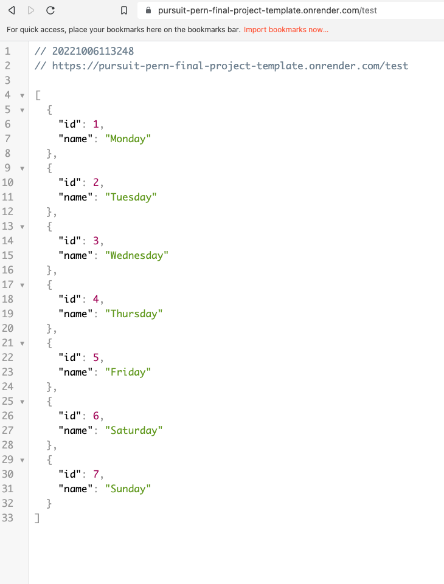

# Deploy an Express Server with a Postgres Database to Fly.io

## Intro

Fly.io is a service that allows you to deploy your servers and a Postgres database for free.

[Fly.io](https://fly.io/)

## Start with the template repository

Select `use this template` from the [PERN final project template](https://github.com/joinpursuit/template-pern-project) on GitHub to get started on your new project. You should be putting this template in your personal GitHub account and not in an organization. The repository should be public. This repository has the correct file structure and configurations to deploy the application to Fly.io as is.

Get this app to run locally to test that it works. If it does not work locally, it will not work online. Follow the instructions in the application's `README.md` file.

Then, after working through this guide, and you have deployed the template and confirmed it works, you should begin building your application, replacing the boilerplate code with your own.

## Getting started with deployment

Log in to Fly.io with GitHub.

[Install flyctl](https://fly.io/docs/hands-on/install-flyctl/) and follow the instructions.

Navigate to the directory where you can download the template onto your machine.

Make sure you are on the same level as `.git` and `package.json`, and then type `Flyctl launch` and follow the prompts.

When you reach the part about adding a Postgres Database select yes and follow the prompts.

For more detailed instructions: [The Hellonode Application](https://fly.io/docs/languages-and-frameworks/node/)

To deploy your app: `flyctl deploy`, you will also need to run this command any time you want to deploy changes you've made to your application's main branch.

To open your app in the browser, type `flyctl open`.

## Set up the PostgreSQL database

You should have chosen to create a new Postgres app from the previous steps.

If you did not create a Postgres app in the last step, type:

- `flyctl postgres create`

And [Follow the instructions here](https://fly.io/docs/reference/postgres/)

You must then connect to the database from your command line using the following:

- `flyctl <command> -a <postgres-app-name>`

Once inside the shell type `\l` to see the list of available databases.

Find your database (it should match `<postgres-app-name>` from the previous step) and connect to it.

- `/c <postgres-app-name>`

You should get a new prompt.


Copy and paste what is in the `back-end/db/prod_schema.sql` file.

Example:

```sql
DROP TABLE IF EXISTS test;

CREATE TABLE test (
 id SERIAL PRIMARY KEY,
 name TEXT
);
```

Then, copy and paste what is in `back-end/db/prod_seed.sql`

Example:

```sql
INSERT INTO test (name) VALUES
('Monday'),
('Tuesday'),
('Wednesday'),
('Thursday'),
('Friday'),
('Saturday'),
('Sunday');
```

Once you have tested everything, you can drop this table using the same command line you have open.

Later, you will create your schema and seeds for your app. You will add and modify them through this command line.

## Attaching and detaching the database

[Follow the instructions here](https://fly.io/docs/reference/postgres/) to attach and detach databases to and from your server applications.

To see the data from the database, go to the URL for your deployed app and add `/test` to the end of the URL. You should see an array of days of the week.


