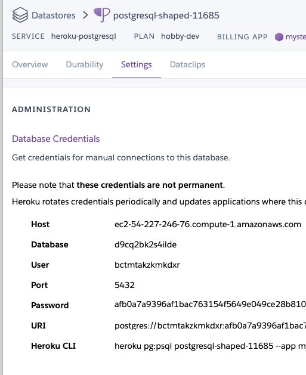
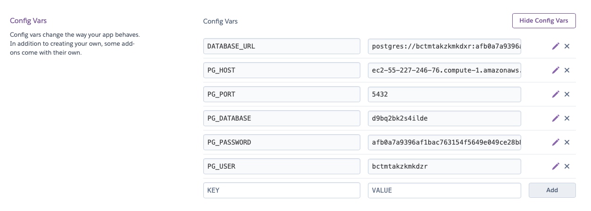

- `heroku create`
- `git add .`
- `git commit -m 'heroku deployment`
- `git push heroku main` - if this does not work, go to heroku dashboard => deployment and add the remote

ie `heroku git:remote -a <your-heroku-app-name>`

Open your heroku app. You should see the `Hello, world!` message.

#### Adding the Database on Heroku

In the heroku dashboard, go to `Overview` choose `configure add ons`

In the search bar `Quickly add add-ons` - search for `postgres` - choose `heroku postgres`

- Choose hobby dev
- Note: even though hobby dev is free, you may be required to provide a credit card
- In new view, click on `heroku Postgres / attached as DATABASE` => Settings



You will need to make these key value pairs in your heroku app

**IMPORTANT**
The `keys` must match perfectly with what is in your `db/dbConfig.js` file and your local `.env`

- Open a new tab/window and go to the main page of your heroku app choose settings
- Reveal Config Variables
- Add the variables

**Note:** these are false credentials and given for example only:

```
PG_HOST=ec2-55-227-246-76.compute-1.amazonaws.com
PG_PORT=5432
PG_DATABASE=d9bq2bk2s4ilde
PG_USER=bcwmtakzkmkdxr
PG_PASSWORD=afb0a7a9396af1bac763154f5649e049ce280658bef0ded7efde6
```



- make sure you are on the same directory level as your `package.json` of your `back-end` directory

Go back to the heroku database view => settings

- copy `Heroku CLI` (something like `heroku pg:psql postgresql-shaped-11685 --app mysterious-spires-49488`)
- paste into your terminal

- it should open a `pg shell`

Run the following:

- update the `\i ./db/prod_schema.sql` with the PG_DATABASE value from Heroku
- `\i ./db/prod_schema.sql`
  - success should say `CREATE TABLE`
- update the `\i ./db/prod_seed.sql` with the PG_DATABASE value from Herkou
- `\i ./db/prod_seed.sql`
  - success should say `INSERT 0 7`
- `\q`

This will insert the test table with the days of the week.

Later, when you have build out your app to have your schema and seed data, you will:

- edit the `db/schema.sql` file to be your own
- edit th `db/seed.sql` file to be your own
- reopen this shell and rerun these commands.

**/front-end**

- `cd front-end`
- `npm instal`
- `touch .env`

Replace the URL given with your new heroku URL

**.env**

```
REACT_APP_API_URL=https://mysterious-spire-49483.herokuapp.com
```
