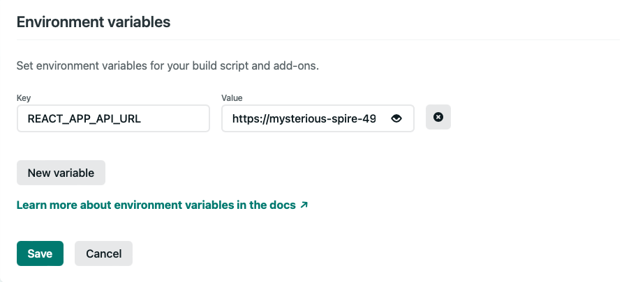
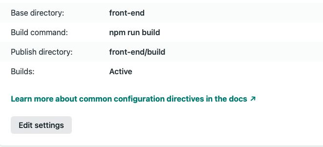

Go to netlify, choose `New site from Git`

- choose continuos deployment, GitHub.
- configure the netlify app on GitHub

Follow the prompts to add this project repo to Netlify
Once, authorized, configure to launch app from

- Base directory: `front-end`
- Build command: `npm run build`
- Publish directory: `build` (may appear as `front-end/build`)
- add the environmental variable





Note: if you were starting your own create-react-app from scratch, in order to use react-router, you would need to add the file `_redirects` to `/public`

The content of the `_redirects` file should be

```
/* /index.html 200
```

[More info](https://www.netlify.com/blog/2016/07/22/deploy-react-apps-in-less-than-30-seconds/#main)
